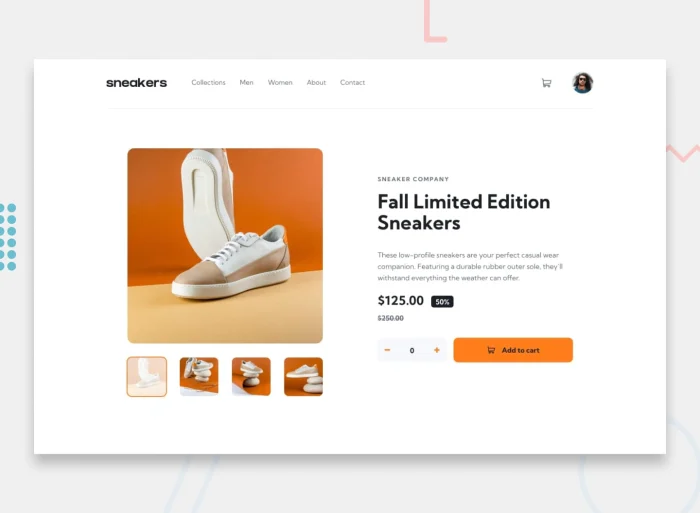

# UI Challenge: Mimic a Beautiful User Interface with React, HTML, and CSS

## Objective

The goal of this challenge is to practice front-end development by recreating an existing UI. Each trainee will select a visually appealing UI to mimic, focusing on details, responsiveness, and functionality using **React**, **HTML**, and **CSS**.



## Requirements

1. **Recreate the Chosen UI**: Select a high-quality UI image (provided or chosen) and rebuild it from scratch.
2. **Use React, HTML, and CSS**: Implement the project using React for component structure and manage styles with CSS or CSS-in-JS.
3. **Attention to Detail**: Focus on accurately mimicking spacing, typography, colors, and layout.
4. **Add the Original UI Image**: Include an image of the original UI as a reference in the project.

## Getting Started

1. **Fork and Clone the Repository**:
   ```bash
   git clone https://github.com/altechemist/CodeTribe.git
   cd product-page-ui
   ```
